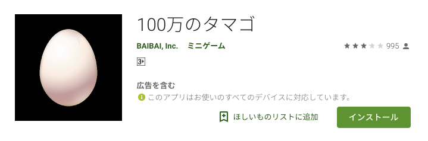
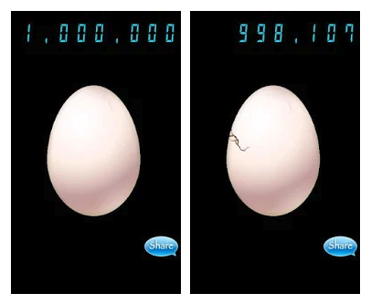

# Introduction
***

## 100万の卵とは？
 

  

100万の卵とは、株式会社バイバイが作成した「誰もやりたくないアプリ」という変わったコンセプトで開発されたモバイルアプリケーションです。

 
 
 

100万の卵は、とてもシンプルで画面に表示されている卵をひたすらタップして100万のカウントを0にしていくというもの。

システムもシンプルなので制作日数は3日程度で、開発者が初めてリリーしたアプリだそうです。
 
 

製作者自身も100ダウンロード行けばいいなと思っていたところ、海外のSNSから火がつき一気にダウンロード数が伸びたそうです。

ちなみに当時スペインで流行っていた「たまごっち」からGooglePlayStoreで検索されダウンロード数が伸びたとか。最近も「どうぶつタワーバトル」で同じようなことがありましたね（どうぶつの森）。
***

## ダウンロード数や収益など

 
 

2014年次のデータですが、100万の卵は世界で累計800万ダウンロード（iOS：300万 / Android：500万）され、累計収益は3,500万〜4,000万円程度だそうです。

 
 

海外でのダウンロード数が圧倒的に多いらしいですが、収益ではダントツで日本が高くて、1ダウンロードあたり10円とのこと。海外だと1ダウンロードあたり平均4円くらいだそうです。

 
 

> 詳細は[こちら](https://appmarketinglabo.net/100man-tamago/)のサイトを確認してください。

 
 
 

前置きはここまでにして早速次のページから制作していきましょう。

 
 