# Unityを起動しよう
まずはUnityを起動しましょう。
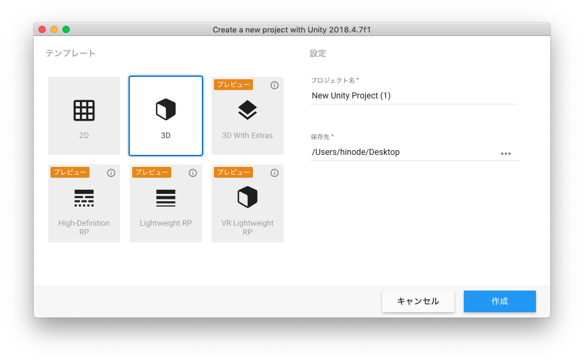
Unityを起動すると、上の画像のようにUnityプロジェクトの作成画面になります。

左のテンプレートで2Dか3Dかを選択します。今回は3Dにします。

プロジェクト名は「Unity Sample」としてください。
 
 


もし同じサーバー内に同時に保存する場合は、名前の前に学籍番号などをつけて自分のプロジェクトだとわかるようにしてください。

 
 
保存先は指定の場所に保存してください。特に指定がなかったら、デスクトップに保存しましょう。

全て設定が終わったら右下の作成ボタンを押してください。

しばらく待つとUnityの開発画面が開かれます。
 
 
***

# Unityの画面構成

## レイアウトのカスタマイズ

Unityが開かれると、下の画像のような画面が出てきます。

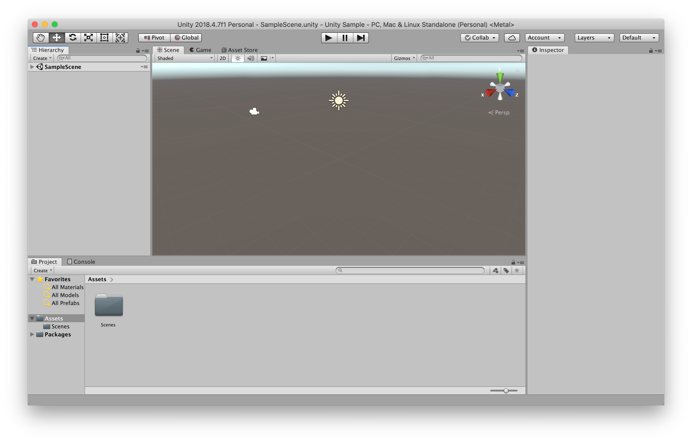

これがUnityのデフォルトの開発画面なのですが、少しわかりにくいので画面を変えたいと思います。

 
 

Unityの右上に「Default」のボタンがあるので、そちらを押して表示された中から「2 by 3」を選択してください。

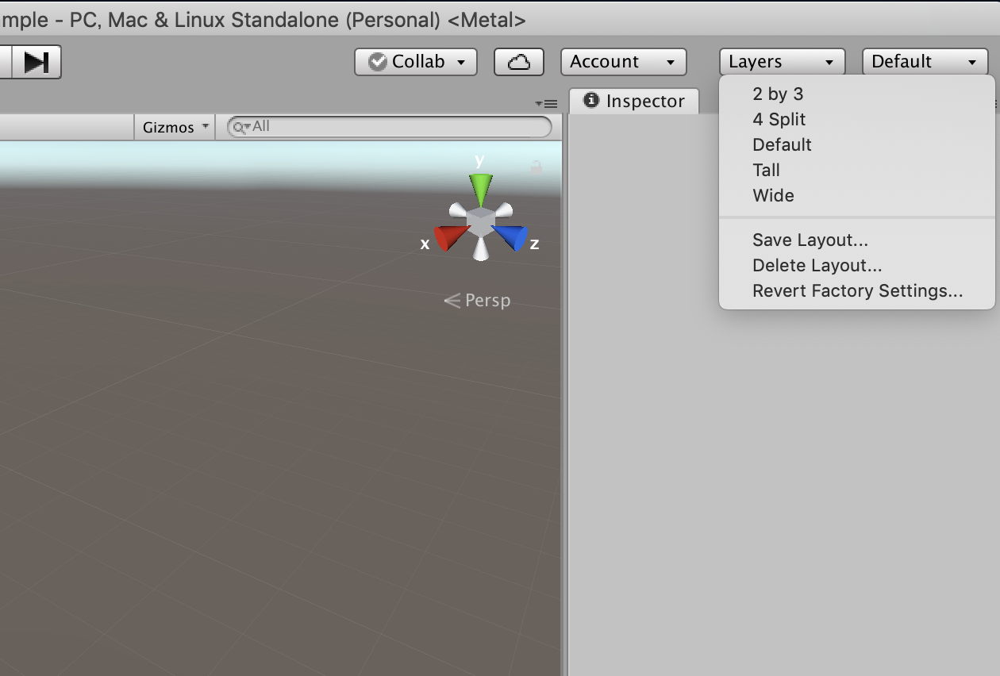

 
 

そうすると、下の画像のようになりました。もう少し変更します。

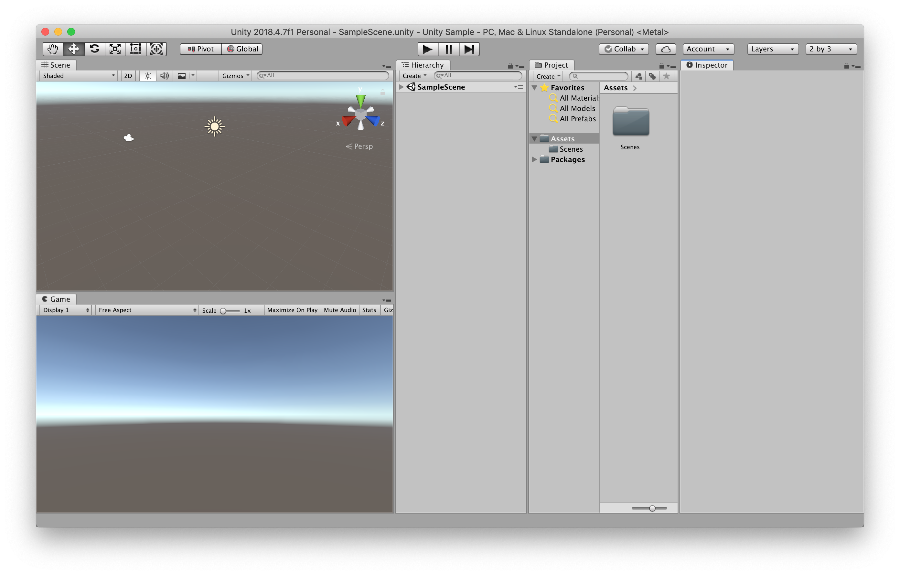
 
 

Projectウィンドウの右側の三本線のアイコンをクリックしてください。そして、出てきたリストの中から「One Column Layout」を選択しましょう。

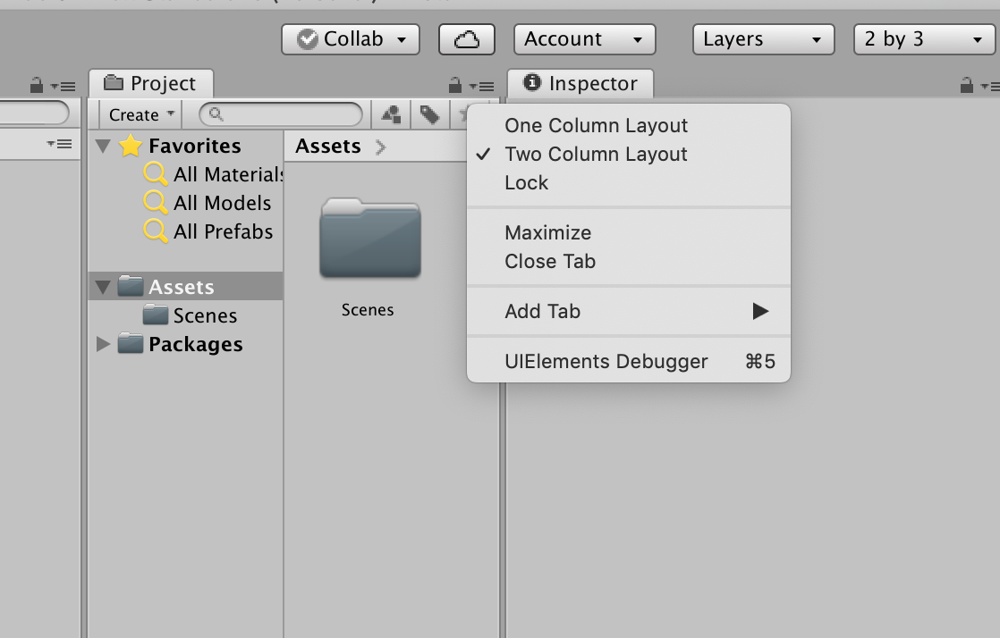

 
 

そうすると、このようにProjectウィンドウが見やすくなります。

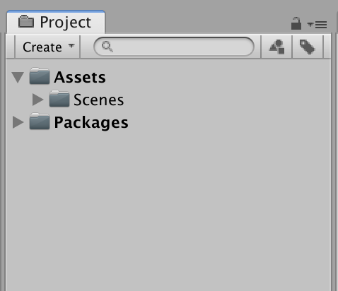

 
 

これで画面のカスタマイズは完了です。

今回は「2 by 3」の画面で進めますが、開発画面は自分のやりやすいレイアウトで問題ありません。

 
 

## 画面の構成

Unityの画面構成は主に以下のようになっています。

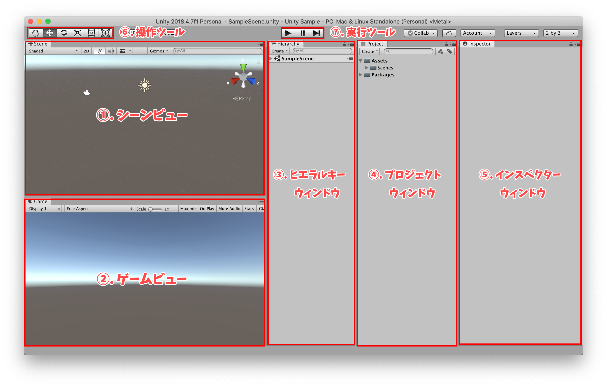

### ①. シーンビュー
　ゲームを組み立てるためのメイン画面です。素材を配置してゲームのシーンを作成するのが主な役割です。
### ②. ゲームビュー
　ゲームを実行した時の見え方を確認するほか、ゲーム時の処理スピードや負荷のかかり方などを解析できます。
### ③. ヒエラルキーウィンドウ
　シーンビューに配置したオブジェクトの名前を一覧で表示します。また、オブジェクト同士の階層構造を表示したり編集したりできます。
### ④. プロジェクトウィンドウ
　ゲームで使う素材を管理します。このウィンドウに画像や音声などの素材をドラック＆ドロップすることで、Unityにゲームの素材として追加することができます。
### ⑤. インスペクターウィンドウ
　インスペクターウィンドウには、シーンビューで選択したオブジェクトの詳しい情報が表示されます。インスペクターでオブジェクトの座標・回転・スケールや色、形などを設定します。
### ⑥. 操作ツール
　シーンビューに配置したオブジェクトの座標や回転、サイズを調整したり、シーンビューの見え方を調整したりするためのツールです。
### ⑦. 実行ツール
　ゲームの実行や停止を行うツールです。

 

最初は何がどういう意味か全く分からないと思いますが、これらは何度も作っていくうちに自然に覚えられるので、今は言葉だけ覚えておけば大丈夫です。
 
 

# オブジェクトの配置

では早速UnityのScene上にオブジェクトを配置したいと思います。

ヒエラルキーウィンドウから「Create -> 3D Object -> Plane」を選択してください。
 

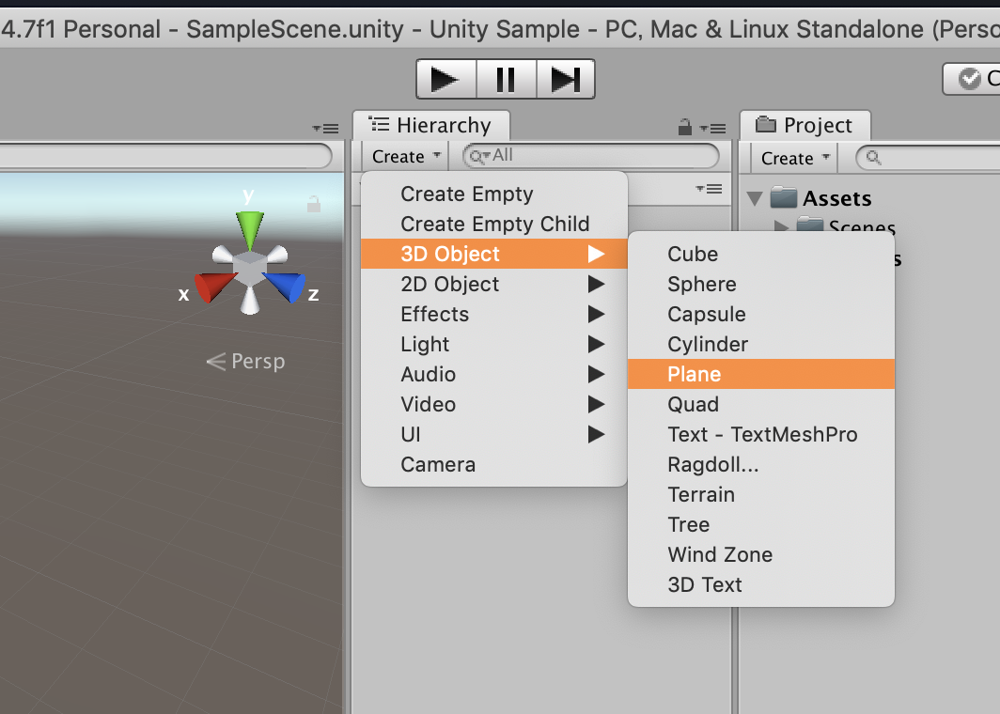

 
 

これでScene内に四角い平面が表示されました。

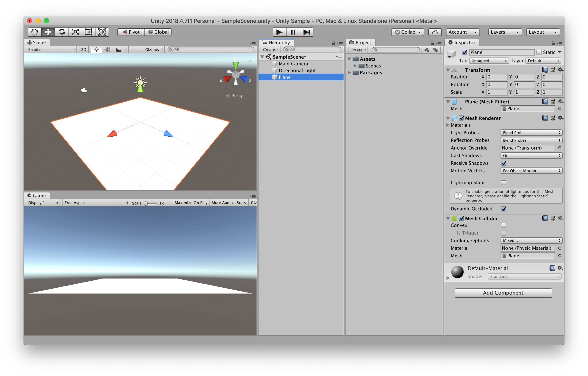

 
 
画面右側にたくさんの項目が出てきたと思いますが、これはインスペクターウィンドウで選択されているオブジェクトの詳細情報です。試しにPlaneのScaleを「x = 2, y = 1, z = 2」にしてみましょう。

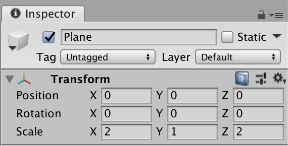

 
 
そうすると、SceneとGameビューのPlane（平面）が２倍の大きさになりました。
 
 

# マテリアルを追加

次にただの白い平面では寂しいので、色をつけたいと思います。

色をつけるためには新たにマテリアルというものを追加する必要があります。

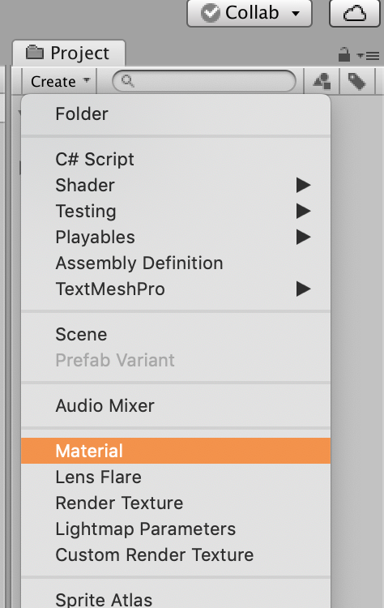

プロジェクトウィンドウから「Create -> Material」を選択してください。

 
 
次に、今作成したMaterialを選択していると、インスペクターウィンドウに下の画像のように白い四角が表示されているかと思います。この白い四角をクリックしてください。

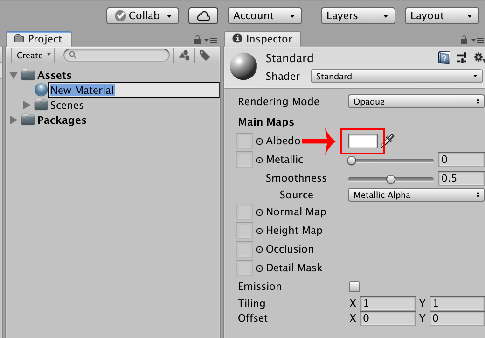

 
 
そうすると、下の画像のようなカラーパレットが表示されたかと思います。

このカラーパレットで色を設定できます。外側の広い円でカラーを選び、内側の四角形の場所で色の濃さを選びます。選び終わったら左上のバツボタンで閉じてしまいましょう。

 
 
色の作成が終わったら「New Material」をScene上のPlaneにドラッグ＆ドロップでつけてください。

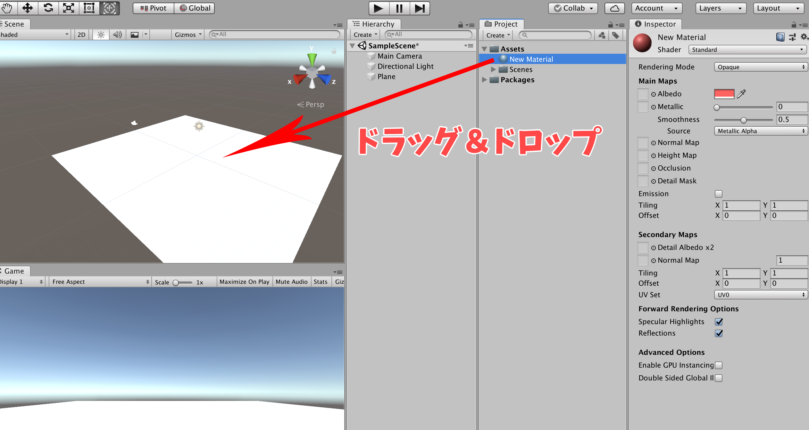

 
 
そうすると、平面に色をつけることができました。

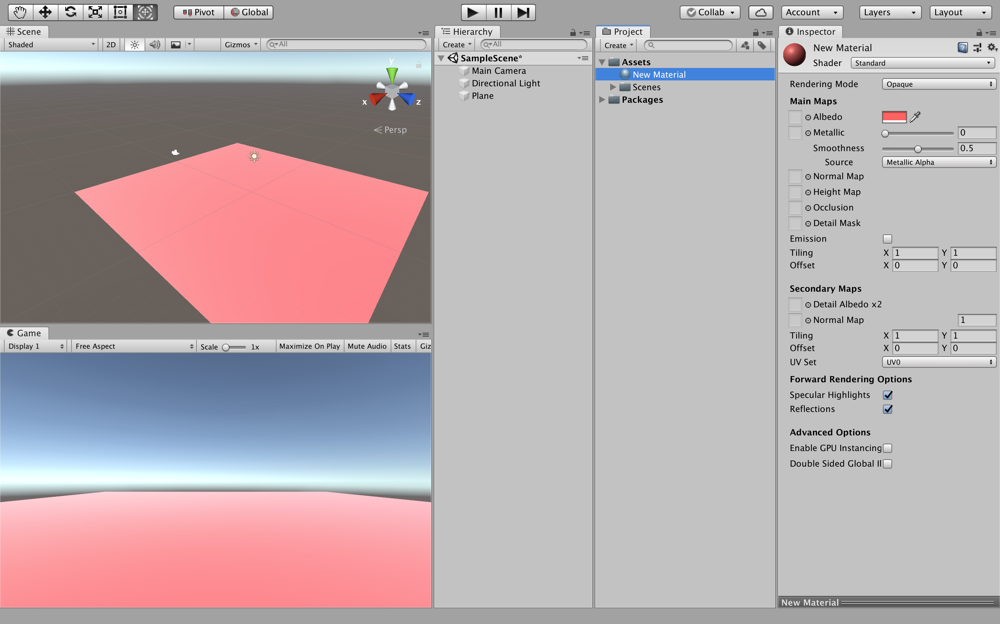

 
 

# 球体の追加

次に球体（Sphere）を追加します。

ヒエラルキーウィンドウから「Create -> 3D Object -> Sphere」を選択してください。

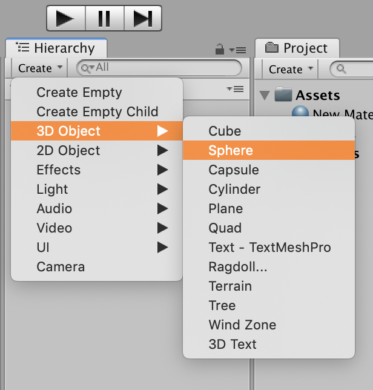

 
 
スフィアが画面からずれていた場合は、SphereのインスペクターウィンドウのTransformの右側の歯車アイコンをクリックし、Resetを選択してください。これでスフィアが画面の中央に表示されます。

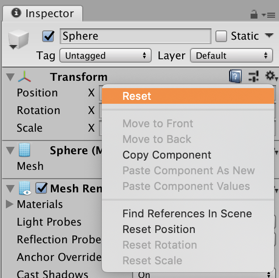

 
 
このままではスフィアが地面に埋まってしまっているので、Sceneウィンドウの左上の十字矢印マークを選択し、緑色の矢印（y座標）を少し上に引っ張ってスフィアを浮かせてください。下の画像くらい浮かせられたらOKです。

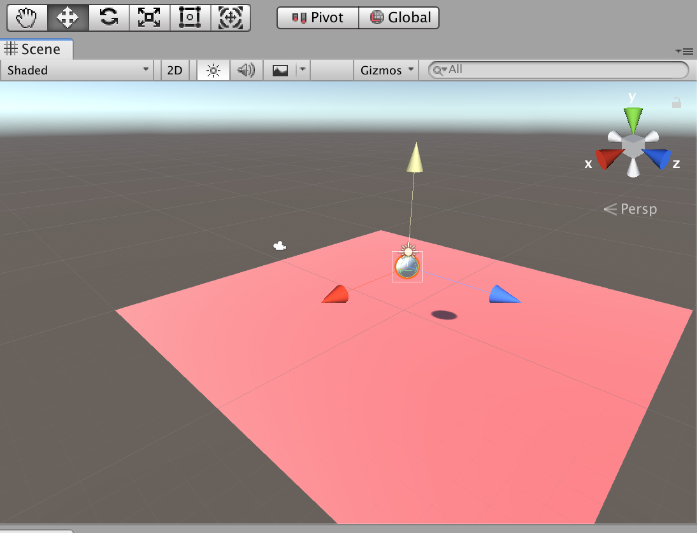


## Challenge
スフィアのカラーを変更してみましょう。


 
 

# Sceneを保存しよう

ここまで記述終わったらSceneを保存しておきましょう。

Unity左上のFile（ファイル）からSave（セーブ）を選択してください。これでこのシーンを保存することができます。保存場所は任意の場所にしてください。

保存をしないと、予期せぬトラブルでUnityが終了してせっかく作ったシーンが最初に戻ってしまうという悲劇がおきてしまいます。

保存は今後もこまめにしておきましょう。

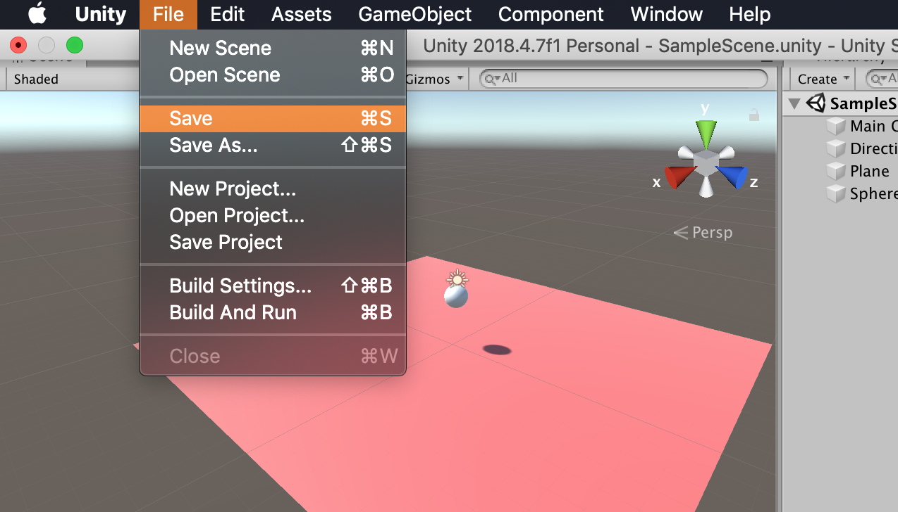
