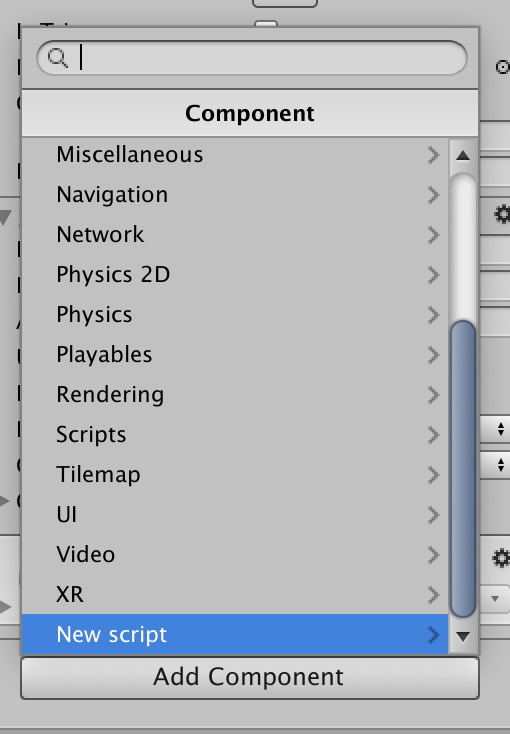
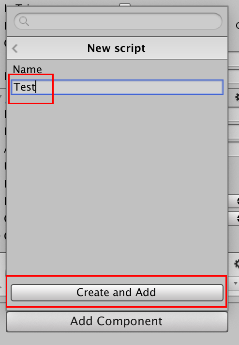
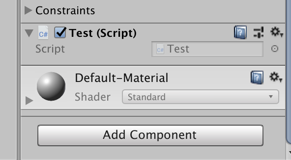
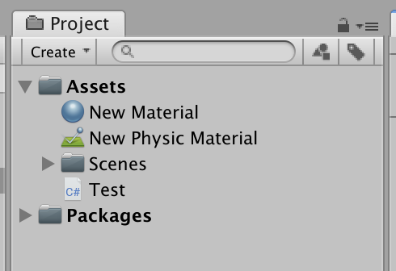
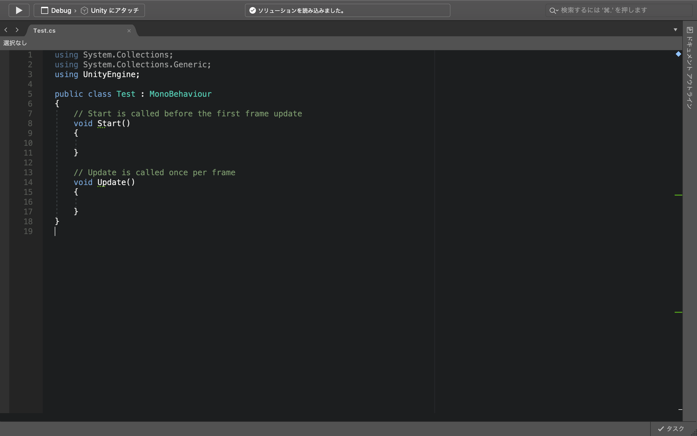
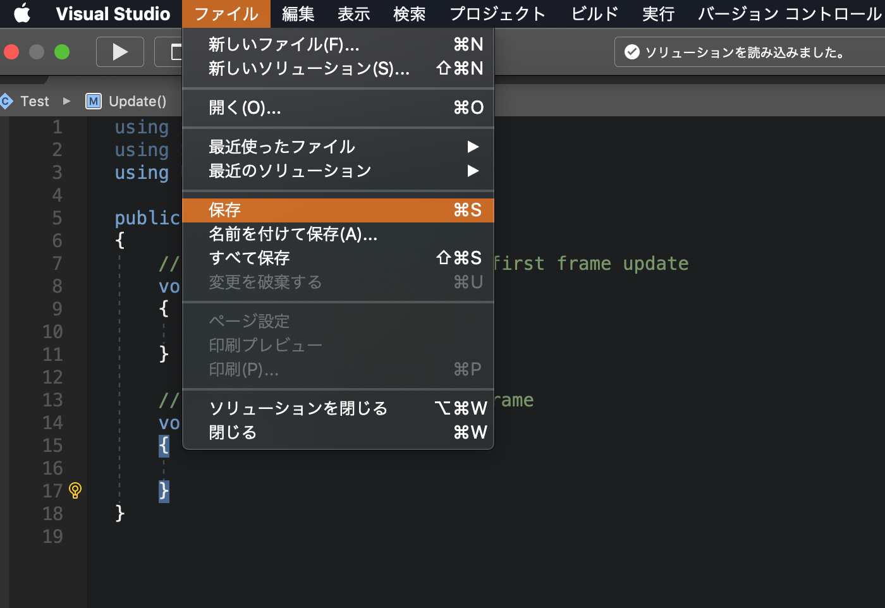
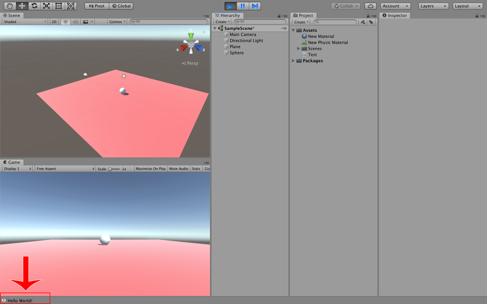
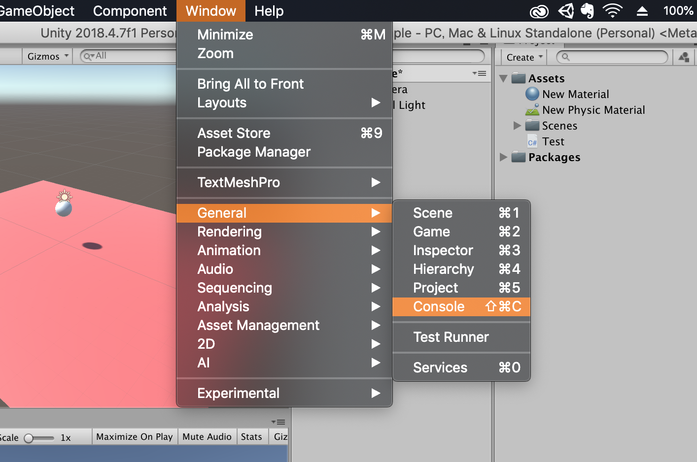
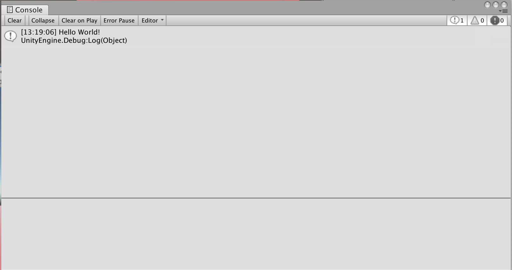
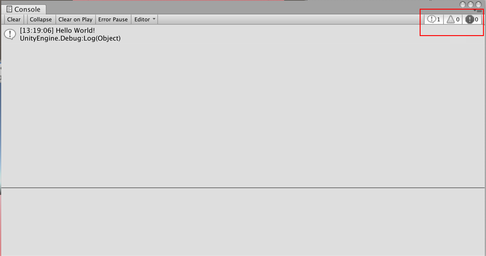

# プログラムを書いてみよう

次に簡単なプログラムを書いてみようと思います。

Unityは「C#」というプログラミング言語で動きます。

<br />
<br />

## プログラムファイルの作成

まずはヒエラルキーウィンドウでSphereを選択し、インスペクターウィンドウの一番下にある「Add Component」をクリックしましょう。


<br />
<br />

そして一番下の「New script」を選択します。



<br />
<br />

次にNew scriptの名前を「Test」とし、「Create and Add」をクリックしてください。



<br />
<br />

そうすると、しばらくしてSphereのインスペクターウィンドウにTestというスクリプトが追加されました。これで新しいスクリプト（プログラムファイル）が作成されます。



<br />
<br />

## プログラムの記述

スクリプトを作成すると、プロジェクトウィンドウにも追加されます。

このTestスクリプトをプロジェクトウィングからダブルクリックで開きましょう。



<br />
<br />

しばらく待っていると、プログラムを書くソフトが立ち上がります。




パソコンによってプログラムを書くソフト（エディタ）が違います。画面が白くてもコードの内容が一致していれば問題ありません。


<br />
`void Start()`メソッドはシーンが起動した時に１度だけ呼ばれます。

`void Update()`メソッドはシーンが起動中ずっと呼ばれ続けます。

つまり、Startメソッドにはゲームの初期値、Updateメソッドにはゲーム実行中の動きなどを記述したりします。

<br />
まずはTestスクリプトのコードを以下のように変更してください。

10行目を追加しました。

```c#
using System.Collections;
using System.Collections.Generic;
using UnityEngine;

public class Test : MonoBehaviour
{
    // Start is called before the first frame update
    void Start()
    {
        Debug.Log("Hello World!");
    }

    // Update is called once per frame
    void Update()
    {

    }
}
```

`Debug.Log("Hello World!");`で、**「コンソールにHello World!と表示しなさい」**という命令文になっております。

​<br />

記述が終わったら、「ファイル -> 保存」を選択して変更を保存しておきましょう。



<br />
次にまたUnityに戻ります。

<br />
Unityに戻ったらPlayボタンを押してください。

実行した後に、Unityの左下に「Hello World!」と表示されていれば成功です。




## 表示されなかった場合
まずはプログラムに誤字脱字がないか確認しましょう。プログラムの中に全角スペースなどが入っていてもエラーになります。

コードに間違いがなかった場合は、もう一度保存をしてみましょう。


<br />
<br />

## それでも表示されない場合

Unityから「Window -> General -> Console」を選択してください。



<br />
下の画像のようなウィンドウが表示され、そこにHello World!と出力されていれば成功です。



<br />
まだ表示されない場合は、コンソールウィンドウの右上の３つの項目が選択されているか確認してください。右から３番目の項目が選択されていない（少し暗くなっている）場合はテキストが表示されないので選択しておきましょう。



<br />
<br />

以上がUnityの簡単な操作方法になります。


Sceneにオブジェクトを配置して、インスペクターから必要な機能（コンポーネント…例えばRigidbody（物理エンジン）など）を追加するだけで簡単なゲームなどは作成することができます。


<br />

Unityで簡単な3Dゲームを作成したい場合は、Udemyの[「ユニティちゃんが教える！初心者向けUnity講座」](https://www.udemy.com/course/unity-chan-tutorial-01/)などがおすすめです。（このコースはUdemyのアカウントを作成するだけで無料で見ることができます）
